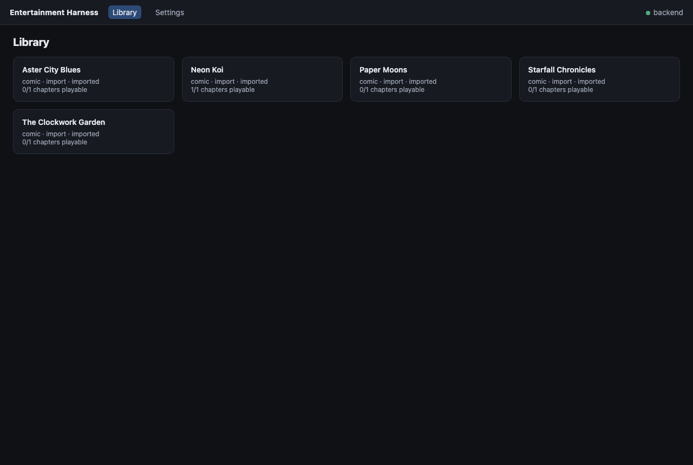
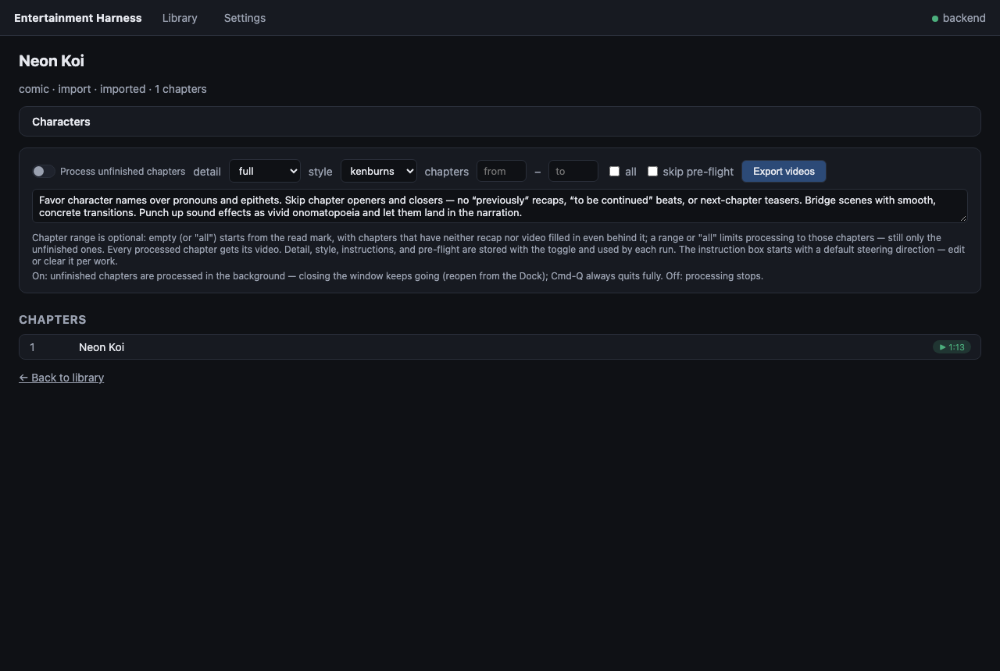

<p align="center">
  
</p>

<h1 align="center">Entertainment Harness</h1>

<p align="center">
  <strong>A local-first entertainment system.</strong>
</p>

<p align="center">
  <a href="https://github.com/terragohan/entertainment-harness/actions/workflows/test.yml"></a>
  
  <a href="#license"></a>
</p>

Track a manga/book library locally, then turn chapters into narrated recap
videos using local vision and language models — no cloud required (remote
backends like OpenRouter or Runway are opt-in). Ships with a native desktop
app for macOS (Apple silicon).

## Demo

Everything below was generated from **synthetic demo content** (abstract
comic pages, fictional titles) produced by
[`scripts/seed_demo.py`](scripts/seed_demo.py) — no real manga is bundled
with this repository.

<p align="center">
  
</p>

<p align="center">
  <em>A chapter recap video: vision-model recap → Kokoro TTS → Ken Burns over the real pages.</em>
</p>

The desktop app — library browsing, per-work processing, playback, settings:

<p align="center">
  
</p>
<p align="center">
  
</p>

To reproduce the demo library locally:

```sh
uv run python scripts/seed_demo.py --data-dir /tmp/eh-demo-data
cd ui && EH_DATA_DIR=/tmp/eh-demo-data bun run dev
```

## Features

- **Local-first library** — SQLite + plain files under your data dir; works,
  chapter progress, recaps, and generated artifacts stay on your machine.
  No account, no tracking.
- **Real sources** — MangaDex and Weeb Central search/add/sync, plus
  `eh import` for your own books and comics (CBZ/EPUB, files or URLs).
- **Local inference by default** — Ollama-hosted vision models (Qwen3-VL by
  default) with hardware-aware quantization policy; OpenRouter / vLLM via
  the `openai_compat` adapter as an opt-in.
- **Recaps & narrations** — chapter artifacts at five detail grains
  (gist → full, full = complete narration) with rolling series context and
  an automatically maintained character registry (`eh cast`), so names stay
  consistent across chapters.
- **Recap videos** — TTS narration over the real chapter pages. Kokoro
  voices built in; macOS `say`; optional voice cloning via mlx-audio.
- **Eight video modes** — from classic Ken Burns to AI frame-by-frame
  animation (see [Video modes](#video-modes)).
- **Manga → anime scenes** — guided storyboard → keyframes and short shots
  from the video model of your choice (Runway `gen4.5` by default) → one
  16:9 mp4 (`eh anime-scene`).
- **Shorts** — vertical 1080×1920 whole-work summary videos with web-search
  grounding (`eh online-summary`, `eh tiktok`).
- **Desktop app** — Electrobun UI speaking to `eh serve` (macOS, Apple
  silicon): browse, process chapters in the background, watch, tweak
  settings. See [`ui/README.md`](ui/README.md).
- **Optional cloud store** — push/pull rendered videos and backups to an
  S3-compatible bucket (Cloudflare R2) so local space can be reclaimed.

## How it works

```
 source sync ──► chapter pages ──► vision LLM recap (detail grain)
                                      │  + rolling story-so-far context
                                      │  + character registry
                                      ▼
                              chapter artifact ──► video script (beats)
                                      │                │
                                      │                ├─► Kokoro TTS per beat
                                      │                ▼
                                      └────► assembly: clips → out.mp4
                                             (mode-dependent visuals)
```

Every stage caches its artifacts, so re-running a chapter only redoes the
stages whose inputs changed. The full architecture, database schema, model
and quantization policy, and pipeline details live in
[`docs/design.md`](docs/design.md).

## Roadmap

Feature work is tracked as *initiatives* under
[`docs/initiatives/`](docs/initiatives/) — one active at a time, each with
phases and verifiable gates.

**Shipped**

- Desktop app — library, playback, background processing, settings ([desktop-ui](docs/initiatives/desktop-ui/))
- Unified recap pipeline — five detail grains, one video per chapter, steering instructions ([unify-recap-narrate](docs/initiatives/unify-recap-narrate/))
- Video presentation — Ken Burns, scroll mode, anchored panel-first pacing, four extra styles ([video-mode](docs/initiatives/video-mode/), [anchored-scroll](docs/initiatives/anchored-scroll/), [video-styles](docs/initiatives/video-styles/))
- Character bible — per-work cast registry injected into recap prompts ([character-bible](docs/initiatives/character-bible/))
- AI animation modes — `animate` (frames per beat) and `sequence` (frame-by-frame chains) ([panel-animation](docs/initiatives/panel-animation/), [frame-sequence](docs/initiatives/frame-sequence/))
- Plugin system — providers as data, conformance-checked ([plugin-extensibility](docs/initiatives/plugin-extensibility/))

**In development**

- **Manga → anime** — a guided storyboard pipeline: keyframes generated from your panels, assembled into short 16:9 clips ([manga-to-anime-scene](docs/initiatives/manga-to-anime-scene/))
- **Custom sources** — a plugin API for content sources beyond the built-in MangaDex and Weeb Central catalogs

**Up next**

- **Audiobook mode** — `eh listen`: streaming TTS narration, nothing persisted ([audiobook-mode](docs/initiatives/audiobook-mode/), proposed)
- **Streaming** — R2 for static video, localhost bridge for dynamic content ([streaming](docs/initiatives/streaming/), proposed)
- **Player integration** — mpv as the playback engine ([player-integration](docs/initiatives/player-integration/), proposed)

**Later**

- **Native experience** — interactive pan/highlight reading in the macOS app ([native-experience](docs/initiatives/native-experience/), blocked)

## Quickstart

Everything runs from a clone of this repository.

**Prerequisites**

- **Python ≥ 3.13** and [`uv`](https://docs.astral.sh/uv/)
- **ffmpeg** and **ffprobe** on `PATH` (`brew install ffmpeg`)
- For the default local models: [Ollama](https://ollama.com) (optional if
  you configure a remote backend instead)
- For the desktop app: macOS on Apple silicon and
  [Bun](https://bun.sh)

**Clone and run the CLI**

```sh
git clone https://github.com/terragohan/entertainment-harness
cd entertainment-harness
uv sync                     # creates .venv with all dependencies

uv run eh --help
```

**Your first recap video**

```sh
uv run eh add "One Piece"       # search a source and add the series
uv run eh sync                  # fetch its chapter list
uv run eh recap "One Piece" --video --chapters 1
uv run eh play "One Piece"      # watch the generated video
```

The first recap pulls the configured Ollama models and downloads TTS
weights (~350 MB) — later runs start immediately.

**The desktop app**

```sh
cd ui
bun install
bun run dev        # builds and launches the app against your real data dir
```

The app runs from the checkout: it spawns `uv run eh serve` from the repo
and connects to it.

## Configuration

All state — the library database, downloaded pages, artifacts, videos, and
`config.toml` — lives in one data directory:

```
~/.local/share/entertainment-harness/       # override with EH_DATA_DIR
```

Edit `config.toml` directly or through the app's Settings screen. Every
setting has a built-in default; an empty config file works.

### Model backends

| Backend | Use | Setup |
|---|---|---|
| `ollama` (default) | Local vision/text models | Install Ollama; models are pulled on demand |
| `openai_compat` | OpenRouter, vLLM, any OpenAI-style endpoint | Set `base_url` + `api_key` in `[models.openai_compat]` |
| `huggingface` | Local LFM2.5-VL via transformers | `uv sync --extra dataset` |

Models are assigned per **role** — `vision`, `text`, `translation`, `judge`
— under `[models]`, so you can mix backends (e.g. local text model, remote
vision model).

### API keys

Keys are only needed for opt-in remote features. All of them can live in
`config.toml` or the environment:

| Feature | Config section | Env fallback |
|---|---|---|
| OpenRouter / vLLM | `[models.openai_compat] api_key` | `OPENAI_COMPAT_API_KEY`, `OPENROUTER_API_KEY` |
| Runway (anime-scene, tiktok clips) | `[runway] api_key` | `RUNWAY_API_KEY` |
| Cloud store (R2/S3) | `[store] …` | standard AWS env vars |

### Recap detail grains

`--detail` (or `[pipeline] detail =`) picks how much text each chapter
artifact carries — and therefore how long its video narrates:

| Grain | What you get |
|---|---|
| `gist` | 2–4 sentences |
| `brief` | one paragraph |
| `standard` (default) | the chapter's beats |
| `detailed` | every notable beat |
| `full` | complete in-order retelling (narration) |

Chapters with a lower-grain artifact are upgraded in place when you ask for
a higher grain; videos follow the artifact's grain.

### Video modes

`--video-mode` (or `[video] mode =`):

| Mode | Visuals |
|---|---|
| `kenburns` (default) | pans/zooms over the real pages |
| `scroll` | continuous vertical scroll through the chapter |
| `slideshow` | page-per-segment cuts |
| `cards` | generated caption cards (the only mode for text books) |
| `panels` | detected panels, one per beat |
| `motion` | panels with synthesized camera motion |
| `animate` | AI-generated animation frames per panel (`[frames]` provider) |
| `sequence` | panel outpainted to video size, AI frames chained into motion (`[sequence]` provider) |

`animate` and `sequence` run on the image model of your choice — Runway or
any OpenRouter image model — configured in `[frames]` / `[sequence]`
(provider defaults: Runway `gen4_image`, OpenRouter
`google/gemini-2.5-flash-image`).

### Voices

`[video] tts_engine =` `kokoro` (default; `voice = "af_heart"`, dozens of
built-in voices), `say` (any macOS system voice), or `qwen3` (voice cloning
from a reference sample — `uv sync --extra qwen3`, manage with
`eh voices`).

## CLI tour

```
Library      eh search · eh add · eh remove · eh sync · eh list · eh show
             eh import · eh rebuild-index · eh cast
Pipeline     eh recap [--detail …] [--video] [--video-mode …] [--translated]
Playback     eh play · eh concat · eh compress · eh wipe
Shorts       eh online-summary · eh tiktok · eh anime-scene
Models       eh models · eh quantize · eh voices
System       eh sources · eh plugins · eh serve
```

Every command has `--help`. Some favorites:

```sh
uv run eh recap "One Piece" --video --chapters 47-97 --detail full
uv run eh recap "One Piece" --video --video-mode sequence
uv run eh tiktok "One Piece"                 # vertical whole-work short
uv run eh concat "One Piece"                 # one long mp4 from chapter videos
```

## Desktop app notes

- **Background processing**: each work has a "Process unfinished chapters"
  toggle (off by default). While on, closing the window keeps generation
  going; Cmd-Q always quits fully. Processing never resumes on its own
  after a restart.
- **One instance per data dir**: the library is SQLite — run a single
  app/`eh serve` per data directory at a time.
- **Gatekeeper**: self-built apps are ad-hoc signed — right-click → Open
  the first time.

## Using generated content

**The videos you generate are yours.** The license below covers the
*software*; it places no conditions on the *output* of the software.

**The source material is not yours.** Manga, comics, and books are
copyrighted by their authors and publishers, and a recap video made from
scanned pages is a derivative work of that material. Entertainment Harness
is built as a personal media tool — treat its output like your own notes
and recordings:

- **Personal use is the intended use.** Watch locally, keep your library
  private.
- **Think twice before uploading.** Posting recap videos of copyrighted
  works to YouTube, TikTok, Instagram, etc. can trigger Content ID claims,
  takedowns, or account strikes — regardless of the narration, and even if
  you believe your use is fair. Fair use varies by jurisdiction and
  context; we can't offer legal advice.
- **Safer things to share**: videos made from material you have rights to
  (your own work, public-domain or openly licensed comics, works whose
  rightsholders permit it), or short excerpts with your own genuine
  commentary and criticism.
- **If you do share, attribution is required** — for both the source
  material and the tool. Credit the original work's title and author (and
  the scanlation or translation group, if the pages came from one), link to
  the official release when one exists, and note that the video was "Made
  with Entertainment Harness (https://terragohan.com)". Every rendered
  video ends with a credits card carrying exactly this attribution — keep
  it on anything you share, and don't trim or crop it out. Copy-paste
  templates and per-platform notes: **[SHARING.md](SHARING.md)**. Honor any
  takedown request promptly.

Respect scanlation and fan-translation communities' norms as well: many
groups ask that their work not be re-hosted or monetized.

## FAQ

**Where is my data?**
`~/.local/share/entertainment-harness/` (set `EH_DATA_DIR` to move it).
Delete that directory and the app forgets everything.

**Do I need a GPU?**
No. Local models run through Ollama on CPU/Metal; Apple silicon is
recommended for the desktop app. Remote backends (OpenRouter) need no local
model hardware at all.

**Do I need API keys?**
Not for the default path (Ollama + Kokoro, all local). Keys are only for
opt-in features: OpenRouter models, Runway video generation, cloud store.

**Does it work for text books?**
Yes — import EPUBs and the video uses `cards` mode (generated caption
cards, no page images).

**Can it translate?**
Yes — `eh recap --translated` runs a translation stage first and recaps the
translated pages.

## Contributing

Contributions are welcome — see [`CONTRIBUTING.md`](CONTRIBUTING.md) for
dev setup, the test gates, and the project's conventions. By contributing
you agree your changes are licensed under the project's license (below).

TL;DR:

```sh
uv sync
uv run pytest              # python suite
cd ui && bun install && bun run typecheck && bun run smoke
```

## License

**Source-available**: [GPL-3.0](LICENSE) +
[Commons Clause](COMMONS-CLAUSE.md).

- You **can** use, run, study, modify, and redistribute the software, with
  attribution and the license texts preserved — including inside a company.
- Derivative works you distribute must carry the same license and provide
  source (that's the GPL part).
- You **cannot** sell the software, or offer a paid product or hosted
  service whose value derives substantially from it, without the licensor's
  permission (that's the Commons Clause). For commercial licensing, open
  an issue: <https://github.com/terragohan/entertainment-harness/issues>.

Because of the Commons Clause this project is intentionally **not** OSI
"open source" — "source-available" is the honest label.

**Sharing generated content** is governed by [SHARING.md](SHARING.md):
attribution for both the source material (work + author) and the tool is
required on anything you share, and every render carries a credits end card
by default to make that automatic.

Third-party model weights (Kokoro, DDColor, SAM, Qwen, LFM) download at
runtime from their upstream sources and are licensed by their respective
authors; check those licenses before using outputs commercially.

## Credits

Built on [Kokoro](https://huggingface.co/hexgrad/Kokoro-82M) (TTS),
[Ollama](https://ollama.com) (local models), Qwen3-VL / LFM2.5-VL (vision),
[DDColor](https://github.com/piddnad/DDColor) (colorization), Segment
Anything (panel detection), [Electrobun](https://github.com/blackboardsh/electrobun)
(desktop shell), ffmpeg (everything video), and the MangaDex and Weeb
Central catalogs.
